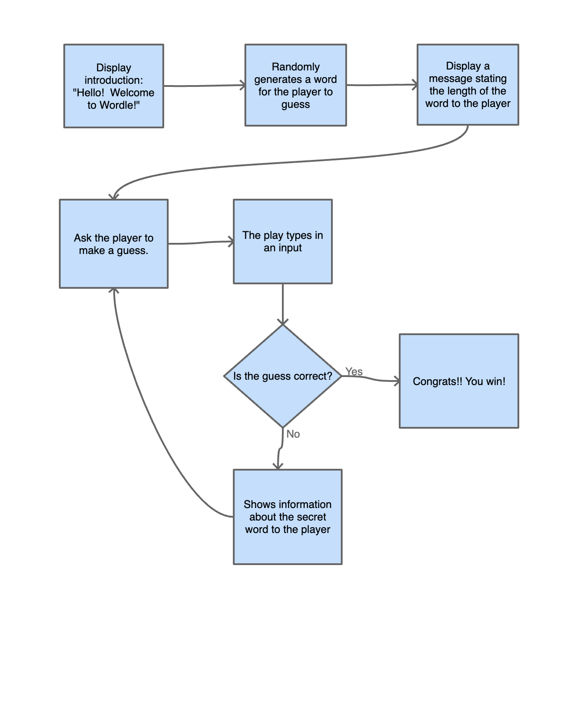
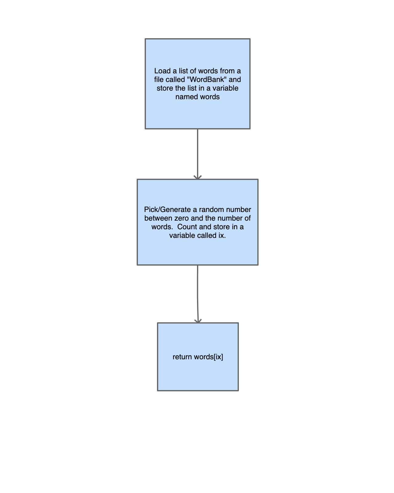
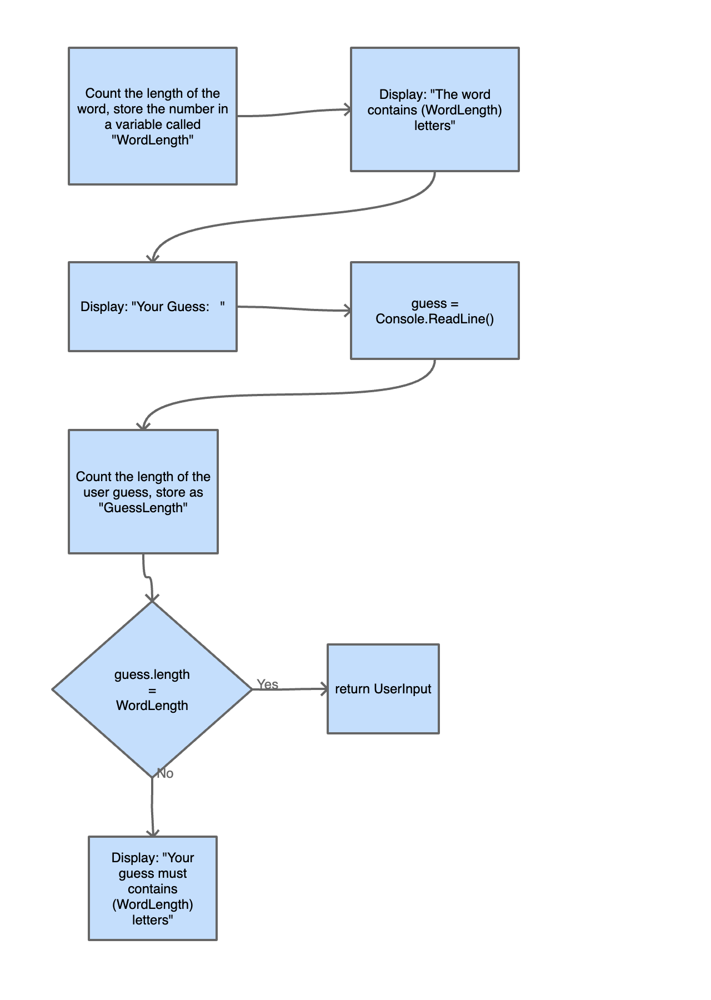
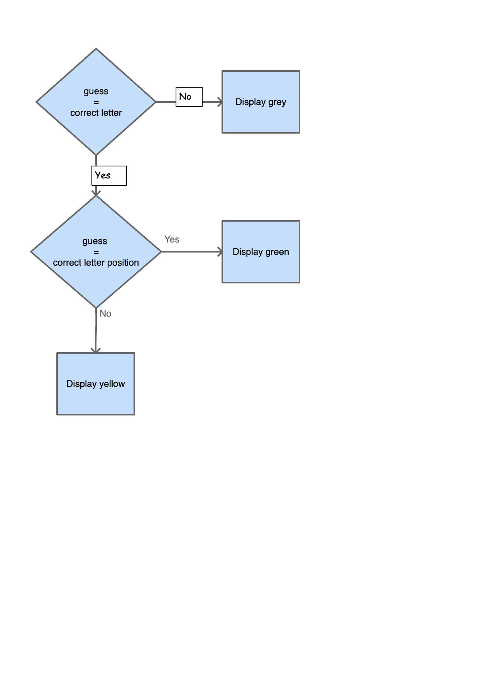

# Word-guessing game

## Description

My project is a word-guessing game which the player starts with knowing the length of the word and attempt to guess the secret word.  Each time when they made a guess, they are told that if a letter is in the word and if a letter is in the correct position.  

## Purpose

The purpose of my word-guessing game is to provide entertainment to the play.  Word-guessing game accepts guesses from the user using keyboard inputs.  The result of each guess is then written to the console.

## High Level Design

At a high level the game works in the following way:

1. Displays an introduction
2. A random word is being generated
3. Waiting for the user to type an input, aka make a guess
4. If the guess is correct, the player wins
5. If the guess is incorrect, the player receives information about the word based on their guess, then it continues asking the player to make attempts

## Flowchart

## Methods

### TheWord Class

Generates a random word for the player to guess.

1. Load a fill called words.txt
2. Store each line as a separate word in a list named words
3. Generate a random number between 0 and words.Count and store the result in a variable called ix
4. Return the word at position ix.

### UserInput Method

Asks the user to make a guess and validates if the input is the correct length before returning it.

1. Count the number of letters in the secret word.
2. Store the number of letters in the secret word in Word.Length.
3. Prompt the user to make a guess
4. Read input from the keyboard and store the results in a variable named guess.
5. If guess is the correct length, return the guess.
6. If guess is the incorrect length, display the message that guess must contains x letters.

### Info

Check if the play successfully guessed the word.  Giving out information about the data of the word such as if the letter exists in the word and if the position is correct.

1. If the guess is in the correct position, select the color green.
2. If the guess is in the correct word but not correct position, select yellow.
3. If the guess is not in the correct word, select grey.
4. Display the guess
5. Reset the color back to white before returning